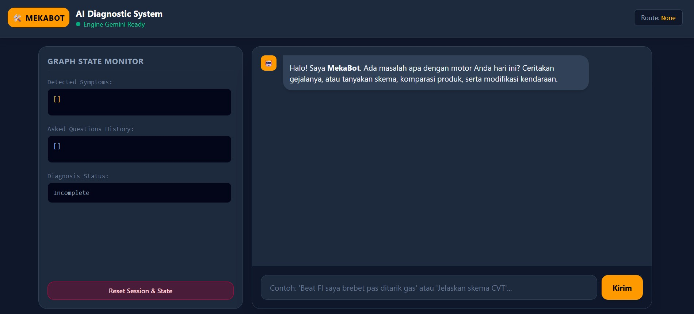
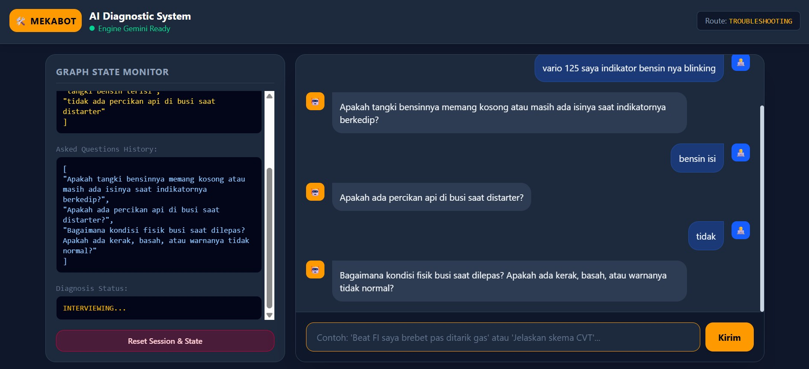
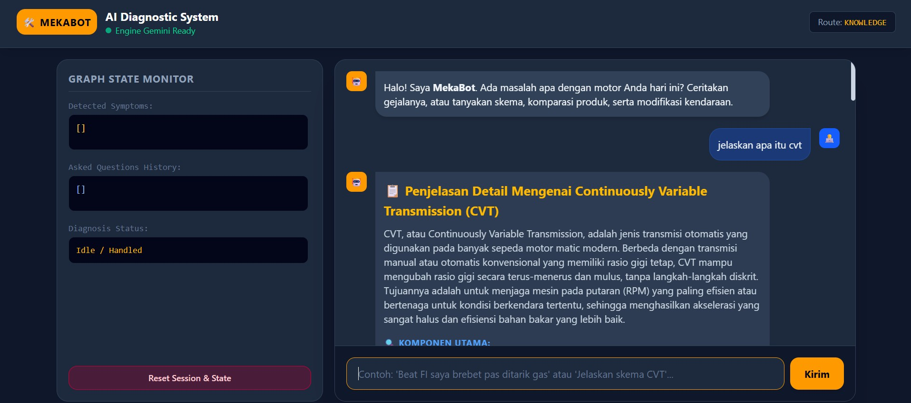

# Mekabot
Program chatbot yang diperuntukan untuk mekanik dalam menangani permasalahan di kendaraan khususnya sepeda motor.
Teknologi yang digunakan untuk pendekatannya yaitu menggunakan RAG dan Agentic Workflow

## Fitur 
Mekabot memiliki beberapa fitur :
* **Menjelaskan Part dan Skema kendaraan** (Knowledge Base RAG)
* **Kelebihan dan kekurangan Produk pabrikan** (Comparison Engine)
* **Improvement & Modifikasi** (Rekomendation Agent)
* **Diagnosis & Perbaikan Kerusakan** Fitur andalan (Stateful Traubleshooting)

## Skema Workflow

### Alur Utama (Main Router)

```
┌────────────────────────────────────────────────────────────────────┐
│                         USER INPUT                                 │
└────────────────────────┬───────────────────────────────────────────┘
                         │
                         ▼
           ┌─────────────────────────────┐
           │   CONDITIONAL ROUTER NODE   │
           │   (Route Classifier)        │
           └────────────┬────────────────┘
                        │
         ┌──────────────┼──────────────┬──────────────┬──────────────┐
         │              │              │              │              │
         ▼              ▼              ▼              ▼              ▼
    [Knowledge]   [Comparison]  [Modification]  [Troubleshooting]
```

### Rute 1: Knowledge Node
**Fungsi**: Penjelasan teknis motor dan komponen
- Skema Motor (Pembakaran, CVT, Body, Aero)
- Penjelasan Detail Part
- Teori Kerja Komponen

```
[Knowledge Node] → [Generate JSON Response] → [END]
```

### Rute 2: Comparison Node
**Fungsi**: Perbandingan antar motor pabrikan
- Kelebihan Motor A vs Motor B
- Kekurangan Motor
- Analisis Spesifikasi

```
[Comparison Node] → [Generate JSON Response] → [END]
```

### Rute 3: Modification Node
**Fungsi**: Rekomendasi upgrade dan modifikasi
- Upgrade Bolt-on (Knalpot, Filter, Gear)
- Bore-up & Engine Tuning
- Remap ECU

```
[Modification Node] → [Generate JSON Response] → [END]
```

### Rute 4: Troubleshooting (Sub-Graph)
**Fungsi**: Diagnosis dan perbaikan kerusakan (Stateful)

```
┌─────────────────────────────────────────────────────────────────┐
│  TROUBLESHOOTING SUB-WORKFLOW                                  │
├─────────────────────────────────────────────────────────────────┤
│                                                                 │
│  ┌──────────────────────────────────┐                          │
│  │  TS EVALUATOR NODE               │                          │
│  │  • Analisis Gejala               │                          │
│  │  • Cek Kecukupan Data            │                          │
│  │  • Generate Pertanyaan Lanjutan  │                          │
│  └──────────────┬───────────────────┘                          │
│                 │                                               │
│         ┌───────┴─────────┐                                    │
│         │                 │                                    │
│    Belum Cukup      Data Cukup                                 │
│    (Interview)      (Solve)                                    │
│         │                 │                                    │
│         ▼                 ▼                                    │
│    [HOLD/END]      [SOLVE NODE]                               │
│  Tunggu jawaban    • Generate Solusi                          │
│  user berikutnya   • Step-by-Step Perbaikan                  │
│                    • JSON Response                            │
│                         │                                     │
│                         ▼                                     │
│                       [END]                                   │
│                                                                 │
└─────────────────────────────────────────────────────────────────┘
```

### State Management

| State Variable | Tipe | Deskripsi |
|---|---|---|
| `user_input` | `str` | Input dari user |
| `current_route` | `str` | Rute yang dipilih router |
| `chat_history` | `List[dict]` | Riwayat percakapan |
| `symptoms` | `List[str]` | Gejala kerusakan motor |
| `asked_questions` | `List[str]` | Pertanyaan yang sudah diajukan |
| `is_complete` | `bool` | Indikator kelengkapan data troubleshooting |
| `response_data` | `dict` | Output JSON akhir |

## Screenshot & Demo

### 1. Inisialisasi Awal (Route: None)
State pertama kali aplikasi dijalankan, menunggu input user untuk routing.



**Status**: Route None | Diagnosis Status: Incomplete

---

### 2. Troubleshooting Interview Mode (Route: TROUBLESHOOTING)
Bot melakukan interview/tanya-jawab untuk mengumpulkan gejala dan informasi teknis motor sebelum memberikan solusi.



**Status**: Route TROUBLESHOOTING | Diagnosis Status: INTERVIEWING...
- Detected Symptoms: tangki bensin terisi, "tidak ada percikan api di busi saat distarter"
- Asked Questions: Pertanyaan untuk validasi gejala lebih detail

---

### 3. Knowledge Base Route (Route: KNOWLEDGE)
Bot menampilkan penjelasan detail teknis mengenai komponen motor berdasarkan pertanyaan user.



**Status**: Route KNOWLEDGE | Diagnosis Status: Idle / Handled
- User Query: "jelaskan apa itu cvt"
- Response: Penjelasan detail Continuously Variable Transmission (CVT) dengan komponen utama dan fungsinya

---

## Implementasi

* file .env berisi : **GOOGLE_API_KEY=**